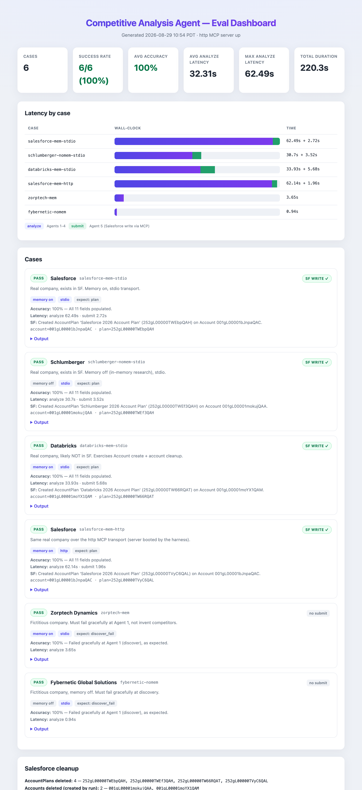

# Competitive Analysis Agent

A multi-agent system that takes a single **company name**, researches it and its top competitors on the live web, synthesizes a strategic **account plan** across 11 dimensions, lets a human review and edit the plan, and writes it into a **Salesforce** org as a standard `AccountPlan` record.

There are two ways to run it: a command-line entry point ([main.py](main.py)) and a **React web app** (the primary experience) with live progress and human-in-the-loop editing before anything is written to Salesforce.

---

## Background

The goal is to compress the manual work a strategic account analyst does: find who a company competes with, read the recent news / financials / positioning on all of them, and turn that into a structured SWOT-plus-competitive account plan that can live in the CRM.

The system does this with a small pipeline of purpose-built agents rather than one large prompt, so each step is independently observable and testable:

| Agent | Role | What it does |
|-------|------|--------------|
| **Agent 1** | Discover | Find the top ~3 competitors (via Comparably) |
| **Agent 2** | Research | Deep competitive intel on each competitor |
| **Agent 3** | Research | Internal research on the primary company |
| **Agent 4** | Synthesize | LLM turns the research into an 11-field account plan |
| **Agent 5** | Write | Persist the (human-edited) plan into Salesforce |

Agents 2 and 3 run in **parallel**. Between Agent 4 and Agent 5, a **human reviews and edits** the plan in the web UI. Agent 5 is deliberately isolated behind an **MCP (Model Context Protocol)** boundary so the Salesforce write is a separate, swappable process rather than an in-line function call.

**Stack**

- **LLM:** gpt-5.5 via LangChain (`ChatOpenAI`, structured output)
- **Web search:** you.com Search API
- **Memory:** mem0 (hosted) — optional, see [The mem0 option](#the-mem0-option)
- **CRM:** Salesforce (`simple-salesforce`, standard `AccountPlan` object)
- **Orchestration:** plain Python + `ThreadPoolExecutor` (not LangGraph)
- **Backend:** FastAPI + Server-Sent Events (live progress)
- **Frontend:** React + Vite
- **Agent 5:** MCP server/client (stdio transport)

---

## The approach — agent + memory architecture


### The 11 account-plan fields

Agent 4 output → Salesforce `AccountPlan` field:

| JSON field | Salesforce field |
|------------|------------------|
| `strengths` | `RelationshipStrengths` |
| `weaknesses` | `RelationshipWeaknesses` |
| `opportunities` | `RelationshipOpportunities` |
| `threats` | `RelationshipThreats` |
| `strategic_priorities` | `AccountStrategicPriorities` |
| `challenges` | `AccountChallenges` |
| `kpis` | `AccountPrfmIndicators` |
| `industry_trends` | `AccountIndustryTrends` |
| `competitive_strengths` | `AccountCompetitiveStrengths` |
| `competitive_weaknesses` | `AccountCmptvWeaknesses` |
| `competitors` | `AccountCompetitors` |

Agent 5 also sets, on the `AccountPlan` record:

| Field | Value |
|-------|-------|
| `Name` | `"<Company> 2026 Account Plan"` |
| `StartDate` | `2026-01-01` |
| `EndDate` | `2026-12-31` |
| `Status` | `Active` |
| `Notes` | `"Updated <timestamp> by LangChain agent"` (provenance stamp) |

### Why MCP for Agent 5

The Salesforce write is exposed as an MCP tool (`create_account_plan`) served by [mcp_server.py](mcp_server.py). The backend never calls Salesforce directly; it calls the MCP client wrapper ([tools/salesforce_client.py](tools/salesforce_client.py)), which invokes the tool and returns `{status, message, details}`. This keeps the CRM write behind a clean, standard, swappable interface.

**Transport modes** (set `mcp_transport` in `.env.demo`, or as an env var):

| Mode | How it runs | Do you start the server? |
|------|-------------|--------------------------|
| `stdio` (default) | The client spawns a fresh `python mcp_server.py` subprocess per submit and it exits when the call completes. | **No.** No daemon or port to manage. A hand-started copy stays idle and is never used. |
| `http` | You run `mcp_server.py` once as a long-running server on a port; the client connects to its URL. | **Yes.** Every submit hits that one process and logs to its window — best for demos/debugging. |

To run the HTTP server (defaults to `http://127.0.0.1:8765/mcp`, override with `mcp_http_host` / `mcp_http_port` / `mcp_http_path`):

```bash
mcp_transport=http .venv/bin/python mcp_server.py   # leave running
```

The web UI also has a **stdio ⟷ http slider** (below the "use memory" checkbox) that sets the transport per submit — no env var needed. When you flip it to http, the UI runs a **preflight health check** against the server URL; if nothing is listening it disables Publish and shows how to start the server (`GET /api/mcp/health?transport=http` backs this). The `mcp_transport` env var still sets the default for CLI runs and for the server process itself.

> In **stdio** mode, running `mcp_server.py` by hand only helps you debug it in isolation (catch startup/import/credential errors) — the app never talks to that instance. If you want the process you started to be the one the app uses, use **http** mode.

**Observability.** Both sides log the MCP round-trip so you can watch it execute. The client emits `[MCP CLIENT]` lines (launching the server, invoking the tool, passing the competitive-analysis JSON, parsing the result) and the server emits `[MCP SERVER]` lines (startup banner, the tool invocation, the 11 received fields, the hand-off to Agent 5, and the returned status). Because stdio owns stdout, the server routes its logs to **stderr** so they never corrupt the JSON-RPC channel. A typical submit looks like:

```
[MCP CLIENT] submit_via_mcp: routing 'Dell' account plan through MCP.
[MCP CLIENT] Launching MCP server '.../python mcp_server.py' over stdio...
[MCP SERVER] Tool 'create_account_plan' invoked.
[MCP SERVER] Received competitive analysis JSON: 11 fields (strengths, weaknesses, ...).
[MCP SERVER] Handing off to Agent 5 (Salesforce write)...
[MCP SERVER] Agent 5 returned status=PASS: Created AccountPlan '...' on Account '...'.
[MCP CLIENT] Parsed result: status=PASS.
```

---

## The mem0 option

mem0 is a hosted long-term memory store. In this system it sits between the research agents (2 & 3) and the synthesis agent (4). It is **optional** and can be toggled with the **"use memory"** checkbox in the web UI (checked by default), or the `use_memory` flag on the API / pipeline.

**With memory** (`use_memory = True`, default):

- Agent 2/3 research is written to mem0, verbatim (`infer=False`), each item stamped with a per-run timestamp (`run_ts`). Nothing is ever deleted; reads filter to the current `run_ts`, so old runs sit harmlessly.
- Agent 4 reads that run's research back from mem0 and synthesizes from it.
- The final account plan is also written back to mem0 under the same `run_ts`.
- **Benefit:** research and plans persist across runs and could be reused.
- **Caveat:** mem0's indexing is asynchronous, so a fresh write may not be immediately readable. The pipeline waits for the run to appear and, if the read-back is still empty, falls back to the in-memory research it just gathered, so synthesis never fails on a read-back race.

**Without memory** (`use_memory = False`):

- The research gathered in-process is handed straight to Agent 4.
- No mem0 calls, no MEM0 API key needed, no read-back race, slightly faster.
- Nothing persists between runs.

**Is mem0 necessary?** For a single end-to-end run, no. It is valuable when you want research/plans to persist and be reusable across runs. Turn it off for the simplest, fastest path.

---

## Setup — running it on your own

### 1. Python environment

```bash
python3 -m venv .venv
.venv/bin/pip install -r requirements.txt
```

(The scripts and [run_web.sh](run_web.sh) expect the venv at `./.venv`.)

### 2. Secrets → create `.env.demo` in the project root

This file is **git-ignored** and holds all credentials. Key names (as read by [config.py](config.py)):

```ini
# LLM
openAI_key=sk-...                 # required (Agent 4 synthesis)

# Web search
youdotcom_key=...                 # required (Agents 1-3)

# mem0 (only needed if "use memory" is on; any one of these names works)
mem0_key=...                      # optional

# Salesforce demo org (Agent 5)
sf_username=you@example.com       # required to write to Salesforce
sf_password=yourpassword          # required
sf_security_token=                # blank if your org/IP doesn't need one
sf_domain=login                   # "login" (prod/dev) or "test" (sandbox)
sf_api_version=64.0               # optional; default 64.0

# Pinecone (declared in config; not required for the current flow)
pinecone_api_key=...
pinecone_index_name=...
```

### 3. Salesforce org prerequisites (one-time, in the org)

The standard `AccountPlan` object and SOAP username/password auth require:

1. **SOAP API login enabled** for the org.
2. The **"Use Any API Client"** system permission assigned to the user (via a permission set), or SOAP `login()` returns `INSUFFICIENT_ACCESS`.
3. **API version 62.0 or newer** — the standard `AccountPlan` object is not visible on older versions. This project pins **v64.0** (`sf_api_version`).

The running user also needs create/read access to `Account` and `AccountPlan`.

> **Security note:** `.env.demo` stores the Salesforce password in plaintext. Keep it git-ignored and rotate the password after any shared demo.

### 4. Frontend dependencies

```bash
cd frontend && npm install
```

---

## How to invoke

### A) Web app (recommended — live progress + human-in-the-loop editing)

```bash
./run_web.sh
```

Then open **http://localhost:5173**.

`run_web.sh` starts both:

- FastAPI backend → http://localhost:8000
- Vite dev server → http://localhost:5173 *(open this one)*

Ctrl-C stops both.

In the UI:

1. Enter a company name (optionally toggle **"use memory"**).
2. Watch the live progress steps as the agents run.
3. Review and edit the 11 account-plan fields.
4. Submit to Salesforce; a **modal** confirms success (with a link to the created record) or explains the failure (e.g. company not found).

You do **not** need to start the MCP server; the submit step launches it automatically over stdio.

### B) Command line (full pipeline, no editing step)

```bash
.venv/bin/python main.py
```

Prompts for a company name, runs Agents 1–5 end to end, prints the account plan, and writes it to Salesforce. *(This path always uses mem0.)*

### C) Backend API directly (without `run_web.sh`)

```bash
.venv/bin/uvicorn api:app --reload --port 8000
```

| Method | Endpoint | Body | Returns |
|--------|----------|------|---------|
| `POST` | `/api/analyze` | `{company, use_memory}` | SSE stream of progress, ending with the plan |
| `POST` | `/api/submit` | `{company, plan}` | writes to Salesforce (MCP), returns `{status, message, details}` |
| `GET` | `/api/health` | — | `{status: "ok"}` |

---

## Evaluation

An evaluation harness ([eval/](eval/)) runs a fixed dataset of companies through the real pipeline and scores four things: **success** (did the flow behave correctly), **accuracy** (content correctness), **latency** (per-phase and total), and **output** (the plan or error each case produced). It writes a self-contained **visual dashboard** you can open in a browser.

**Run it:**

```bash
.venv/bin/python eval/run_eval.py
```

Then open [eval/results/dashboard.html](eval/results/dashboard.html) (data is embedded, so it works over `file://` — no server needed). Raw results land in `eval/results/results.json`.

**The dataset** ([eval/dataset.py](eval/dataset.py)) covers the meaningful axes:

| Axis | Cases |
|------|-------|
| Company reality | **Real** (Salesforce, Schlumberger, Databricks) vs. **fictitious** (must fail gracefully at Agent 1, not hallucinate competitors) |
| Salesforce presence | Accounts that already exist vs. ones the run creates |
| Memory | `use_memory` on vs. off |
| MCP transport | `stdio` vs. `http` (the harness boots the http server itself, then tears it down) |

Each case declares the contract the harness asserts:

- `plan` — analyze must return a plan with **all 11 fields** populated.
- `discover_fail` — analyze must fail at the **discover** stage and must not produce a plan.

**What it measures:**

- **success** — plan produced / graceful failure / Salesforce write passed, as expected.
- **accuracy** — fraction of the 11 fields populated (or, for fictitious companies, whether it failed at the right stage).
- **latency** — analyze (Agents 1-4) vs. submit (Agent 5) wall-clock, timestamped from the SSE stream.
- **output** — the full plan or the error, captured per case.

**Salesforce hygiene (automatic cleanup).** Before the run, the harness snapshots which `Account` records already exist. Afterward it deletes **every `AccountPlan` it created** and only those `Account` records that **did not pre-exist** — so real accounts are protected while test-created ones are removed. The dashboard shows exactly what was deleted vs. protected, and the run leaves the org clean.

> The harness makes real you.com + LLM calls and real Salesforce writes on each run, so it takes a few minutes and consumes API/SF quota. It cleans up after itself, but treat it as a live integration test, not a unit test.

### Sample run

The generated dashboard (metrics, latency-by-case chart, per-case detail, and the Salesforce cleanup log):



A full run (2026-08-29, http server booted by the harness):

| Metric | Value |
|--------|-------|
| Cases | 6 |
| Success rate | **6/6 (100%)** |
| Avg accuracy | **100%** |
| Avg analyze latency | 32.3s (median 32.3s, max 62.5s) |
| Total duration | 220.3s |

Per case:

| Case | Company | Memory | Transport | Expect | Success | Accuracy | Analyze | SF write | Outcome |
|------|---------|--------|-----------|--------|:-------:|:--------:|--------:|:--------:|---------|
| `salesforce-mem-stdio` | Salesforce | on | stdio | plan | ✅ | 100% | 62.5s | PASS | All 11 fields populated |
| `schlumberger-nomem-stdio` | Schlumberger | off | stdio | plan | ✅ | 100% | 30.7s | PASS | All 11 fields populated |
| `databricks-mem-stdio` | Databricks | on | stdio | plan | ✅ | 100% | 33.9s | PASS | All 11 fields populated |
| `salesforce-mem-http` | Salesforce | on | http | plan | ✅ | 100% | 62.1s | PASS | All 11 fields populated |
| `zorptech-mem` | Zorptech Dynamics | on | stdio | discover_fail | ✅ | 100% | 3.7s | — | Failed gracefully at Agent 1, as expected |
| `fybernetic-nomem` | Fybernetic Global Solutions | off | stdio | discover_fail | ✅ | 100% | 0.9s | — | Failed gracefully at Agent 1, as expected |

The fictitious companies fail fast at discovery (under 4s) instead of hallucinating competitors, and the `http` transport case passes identically to `stdio`.

**Cleanup for this run:** 4 `AccountPlan` records deleted, 2 `Account` records deleted (Schlumberger and Databricks, which the run created), 1 `Account` protected (Salesforce, which pre-existed), 0 errors. Verified against the org afterward: all deleted ids gone, the protected account still present.

---

## Project layout

```
main.py                  CLI entry point (Agents 1-5 end to end).
api.py                   FastAPI backend (SSE analyze + submit).
pipeline.py              Orchestration: analyze_stream / analyze / submit.
mcp_server.py            MCP server exposing Agent 5 (create_account_plan).
config.py                Loads .env.demo; shared settings (model, SF, keys).
applog.py                Logging setup.
run_web.sh               Starts backend + frontend together.
requirements.txt         Python dependencies.
.env.demo                Secrets (git-ignored; you create this).

tools/
  web_search.py          Agents 1-3 (you.com search, Comparably parsing).
  account_plan.py        Agent 4 (LLM synthesis, 11-field Pydantic model).
  memory.py              mem0 read/write, run_ts stamping.
  salesforce.py          Agent 5 core (auth, find/create Account, AccountPlan).
  salesforce_client.py   MCP client wrapper (submit_via_mcp).

frontend/
  src/App.jsx            React UI (input, progress, edit, submit, modal).
  src/styles.css         Styling.
  src/main.jsx           React entry.

eval/
  dataset.py             Eval cases (real/fictitious, memory, transport, submit).
  run_eval.py            Harness: runs cases, scores, cleans up SF, builds dashboard.
  results/               Generated: dashboard.html + results.json (git-ignored).
```
